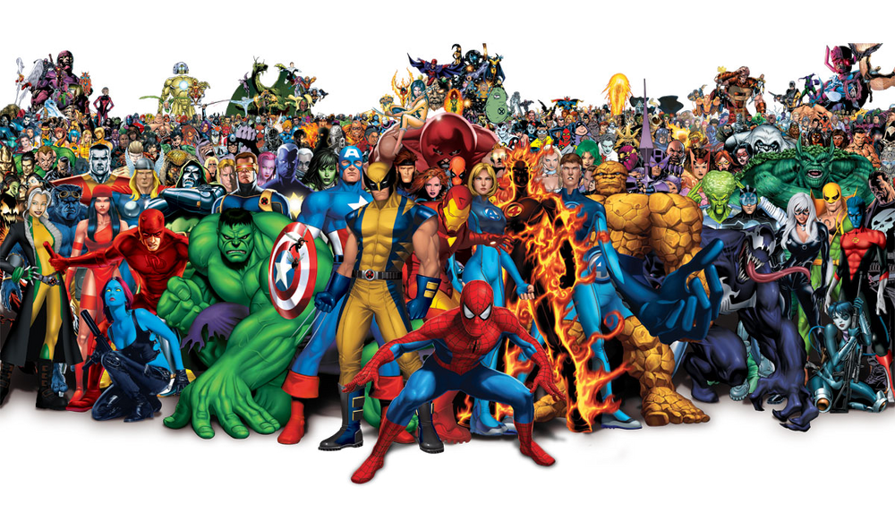

# Earth 616

Earth-616 is the primary continuity, in which most Marvel Comics take place. The universe is based on our reality and frequently makes references to real life celebrities, politicians and events. Technology seems to be a little more advanced than in our realitiy and magic exists. 

## Characters

List: https://marvel.fandom.com/wiki/Category:Earth-616/Characters
