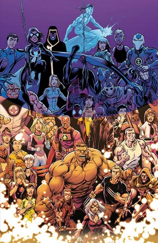

# Earth 1610 - Ultimate universe

Life on this Earth began to develop 200 million years ago. Within fifty million years, it had rapidly evolved into the plethora of taxa that exist today, being ruled by dinosaurs similar to those of the real-life late Cretaceous period 150 million years ago.[1] Owing to the drastic differences between the evolution of life between the real world and Earth-1610, it is unclear exactly when the dinosaurs became extinct and when humans first evolved. 

## Characters

List: https://marvel.fandom.com/wiki/Category:Earth-1610/Characters
